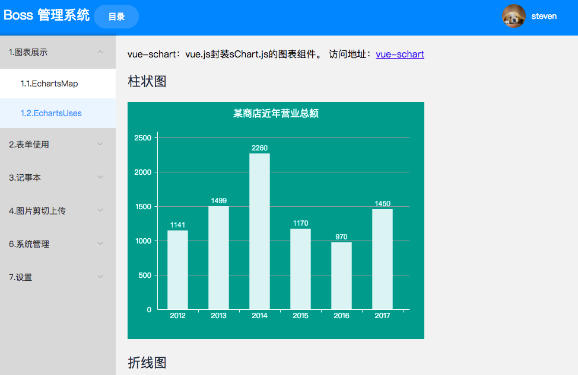
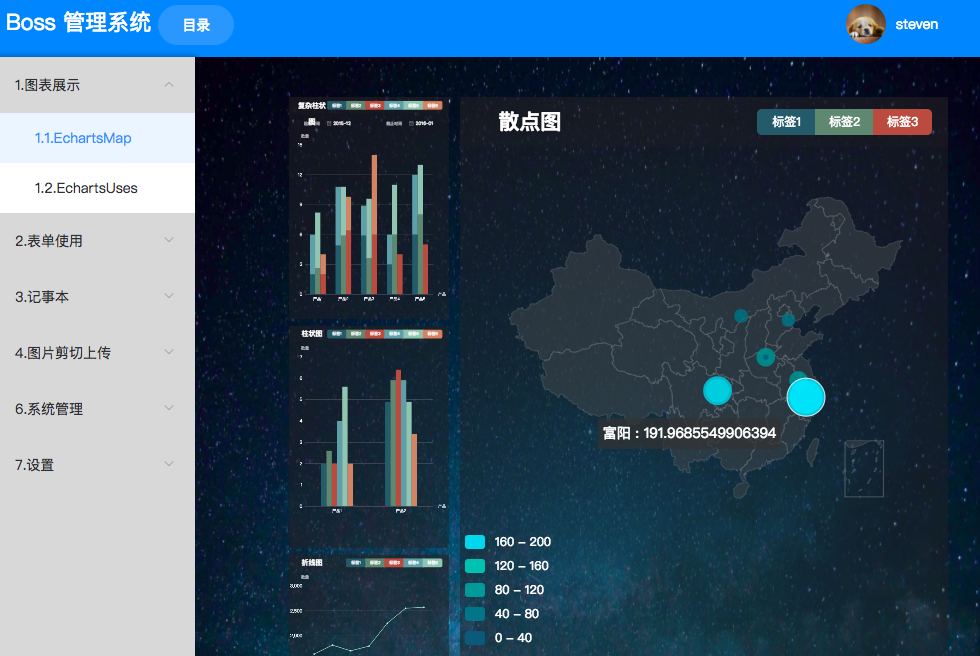
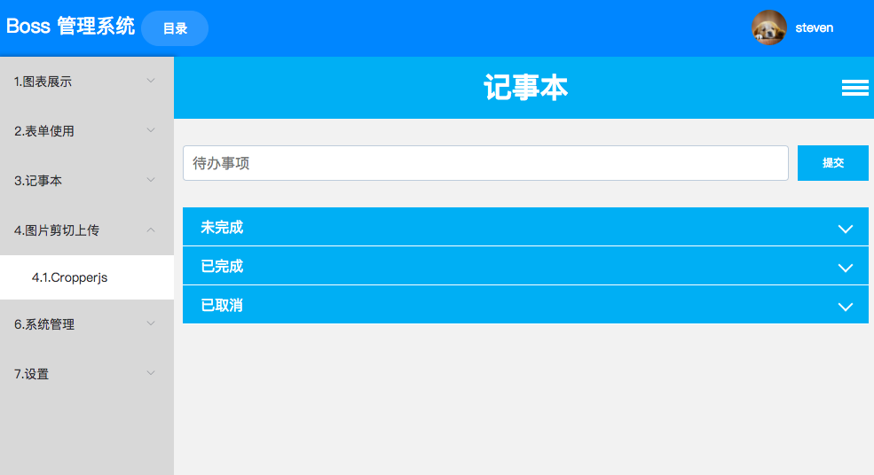

# vue-vuex-notepad

> uses for manage 
>

## Build Setup

``` bash
# install dependencies
npm install

# serve with hot reload at localhost:8080
npm run dev

# build for production with minification
npm run build

```

##技术栈

>vue
>vuex
>axios
>echart



